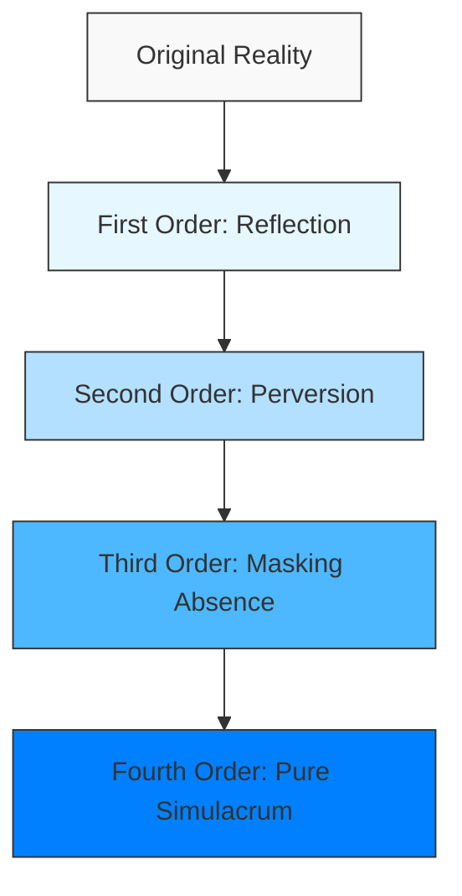
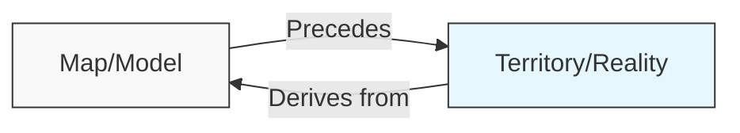
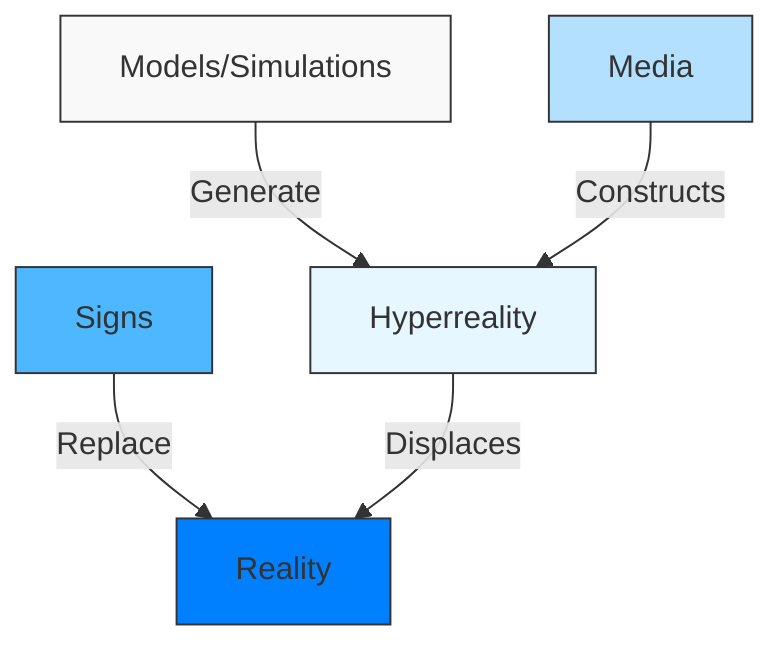
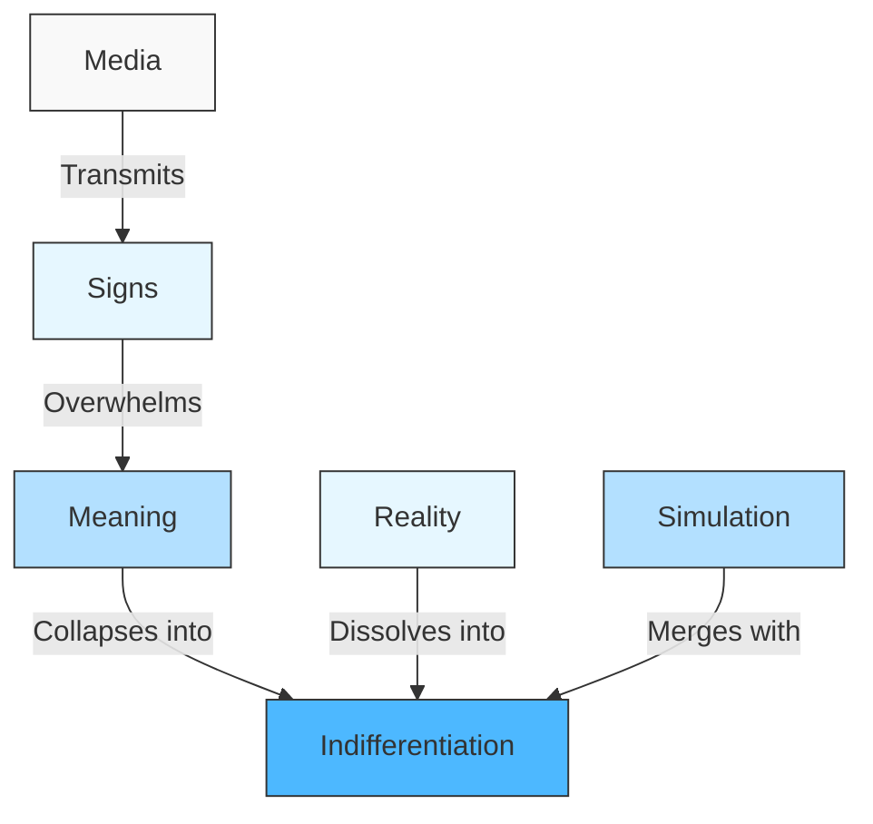
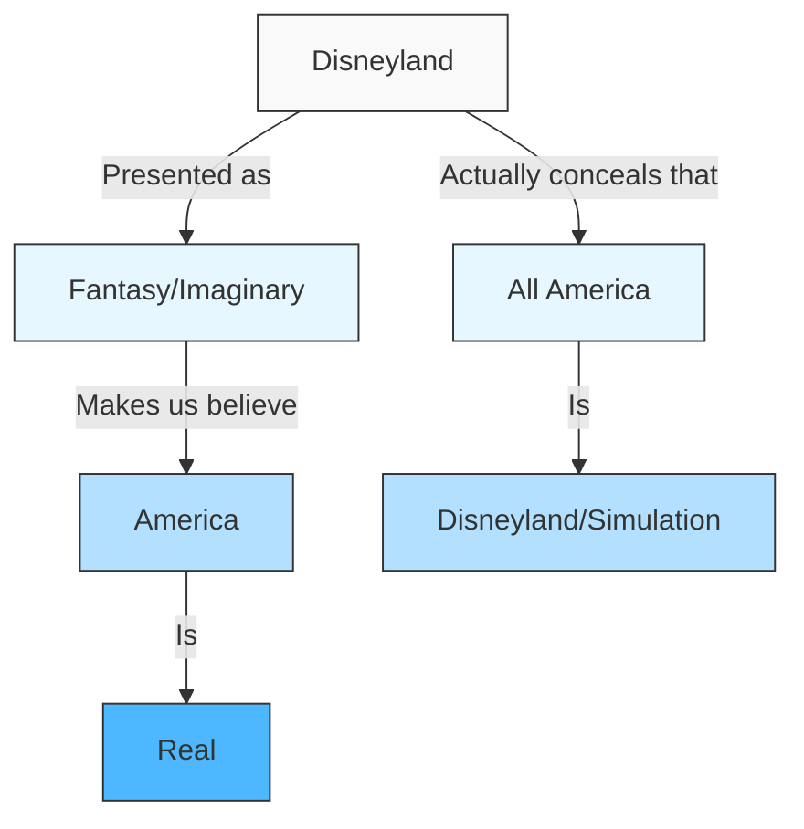

# Simulacra and Simulation - Conceptual Diagrams

## The Four Orders of Simulacra

## The Precession of Simulacra

## Hyperreality Formation

## The Implosion of Meaning

## Disneyland Example

